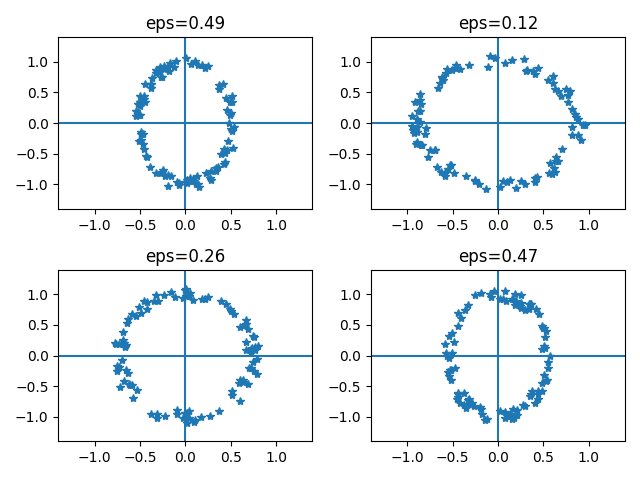
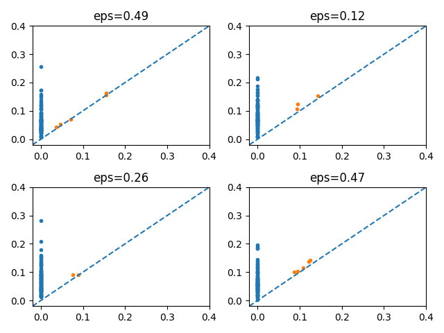

# 1) Summary

aaa

# 2) Statement of Need

Good up-to-date review of the current status of the TDA vectorization methods and libraries can be found in the page [@awesome-tda:2024]. In particular, we can list

* Euler Characteristic Curve [@Richardson:2014],
* Normalized Life Curve:[@Chung:2022]
* Persistent Entropy Summary: [@Atienza:2020],
* Persistence Surface: [@Adams:2017],
* Persistence Landscape: [@Bubenik:2015], [@Chazal:2014]
* Persistence Silhouette [@Chazal:2014]
* Betti Curves: [@Chazal:2021], [@Chung:2022]
* Persistence Block: [@Chan:2022]

Described above vectorization methods were implemented in a series of libraries, both Python (see, for example, [@Giotto:2024], [@GUDHI:2024], [@Persin:2024]) and R (see, for example, [@TDA:2024], [@TDAstats:2024], [@TDAvec:2022]).

As you can see from the table below, however, we do not have a python package, that implements all of them. The goal of the proposed library is to fill this gap.

\newcommand{\cm}{$\checkmark$}

Method | this | Giotto-TDA | GUDHI | Persim | TDA | TDAvec
------- | ---- | --------- | ----- | ------ |  -- | ------
BC      | \cm     |  \cm        |  \cm    |        |     |  \cm
ECC     | \cm    |           |       |        |     |  \cm
NLC     | \cm    |            |       |        |     |  \cm
PES     | \cm    |            | \cm     |        |     |  \cm
PS      | \cm    |  \cm         | \cm     |        |  \cm  |  \cm
PL     | \cm    |  \cm         | \cm     |   \cm    |  \cm  |  \cm
PI     | \cm    |  \cm         | \cm     |   \cm    |     |  \cm
VPB    | \cm    |            |       |        |     |  \cm

# 3) Software Details and Program Workflow

Considered in this paper package follows usual to TDA approach workflow: we start with some original data (collection of the data clouds, for example), convert them to the persistence diagrams, and then vectorize them using implemented in the library functions. Resulting vectors are then used as predictors for some ML method, like linear regression, logistic regression, classification, etc.

In the current section we will demonstrate the work of the proposed library on a simple example of 2-dimensional ellipse-like point clouds. Using included in the package function **createEllipse()** some set of ellipses with different proportions of axis is generated:

    > clouds = []
    > ratList = np.random.uniform(-0.5, 0.5, 10**3)
    > for ratio in ratList:
    >    clouds = clouds + [createEllipse(a=1-ratio, b=1, eps=0.1)]

You can see some typical results in the figure below:

The most simples way to generate persistence diagrams from these point clouds is to use supplied with use main package class **TDAvectorizer**:

    > vectorizer = TDAvectorizer()
    > vectorizer.fit(clouds)

In the figure below you can see some example of persistence diagrams:

Once the TDAvectorizer is fitted, you can transform these persistence diagrams into vector representation using the `transform` method. The resulting vectors are then used as predictors:

    > X = vectorizer.transform(homDim = 1, output = "PS")
    > X_train, X_test, y_train, y_test = \
    >    train_test_split(X, ratList, train_size=0.8, random_state=42)
    > model = LinearRegression().fit(X_train, y_train)
    > score = model.score(X_test, y_test)
    > print("score = {:.3f}".format(score))
    score = 0.979
You can see from this example, that when calling the `transform` method you can choose different vectorization methods and dimension of homology dimension. It is also possible to specify such parameters as vector grid, etc. The same parameters can also be stored as object properties by calling the `setParams` method:

    > vectorizer.setParams({"homDim": 1, "output": "PS"})  

Described approach makes it convenient to perform a systematic analysis and compare performance of different vector representations. In the figure below you can see some correlations between vectors and their correlation coefficients:

To get more detailed information you should perform such simulation several times, so that you can see the general pattern, determine mean values and spread of each methods' score. You can see in the table below the results of the analysis:

| method   | 0                 | 1                 |
|:---------|:------------------|:------------------|
| ECC      | $0.97 \pm 0.004$  | $0.99 \pm 0.012$  |
| NL       | $0.964 \pm 0.011$ | $0.986 \pm 0.004$ |
| PES      | $0.972 \pm 0.004$ | ---               |
| PI       | $0.969 \pm 0.007$ | $0.96 \pm 0.028$  |
| PL       | ---              | $0.985 \pm 0.002$ |
| PS       | $0.964 \pm 0.009$ | $0.982 \pm 0.007$ |
| VAB      | $0.971 \pm 0.004$ | $0.984 \pm 0.015$ |

From this table it is clear that almost all results are comparable with each other, but ECC method with homDim = 1 is the best solution for the current data set. Surprisingly, for some of the feature extraction methods (PES with homDim = 1 and PL with homDim = 0) the results were very bad and the simulation score turned out to be negative.

It should be mentioned also that TDAvectorizer class is not the only way to perform the vectorization of the persistence diagram. In addition to described above approach you can also call directly provided with the package vectorization functions, like

    > TDAvectorizer.computeECC(pd, 0, np.linspace(0,2,20))

In the table below you can see the format of all other vectorization functions

# 5) Conclusion

# 6) Acknowledgements

# 7) References

    